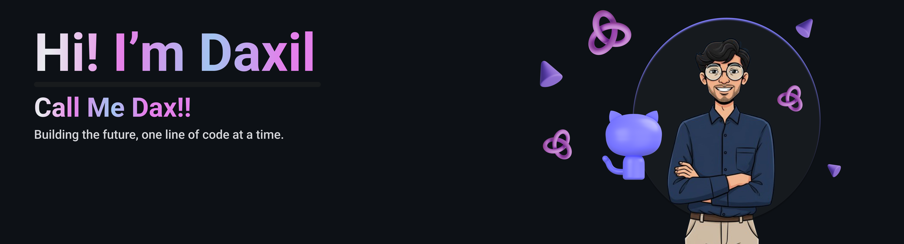

   
  
  
  

<h2>🚀About Me</h2>

  <strong>Full Stack Developer</strong> & <strong>Generative AI Expert</strong>, crafting smart tools that make a difference.
  I turn <strong>ideas into reality</strong> through intelligent code and innovation.
  Always learning, always building — exploring the intersection of <strong>code, intelligence, and creativity</strong>.

<h3>✨Current Works</h3>
<ul>
  <li>🧑‍💻 Working on <strong>Digital Forensic</strong> Framework: MetaData & File-System Analysis</li>
  <li>📧 AI powered email Assistant WebApp: <strong>MailMind.AI</strong></li>
  <li>💸 Startup: <strong><a href="https://www.ideocity.com">ideocity.com</a></strong> - Validate, research, and build product ideas</li>
  <li>📚 Exploring Deep Learning, NLP & OpenCV</li>
  <li>🏆 Competing in Leetcode</li>
</ul>

<h3>🏆 Achievements & Highlights</h3>
<ul>
  <li>🏆 <strong>Knight</strong> on Leetcode</li>
  <li>🎖 Solved <strong>500+</strong> Leetcode problems</li>
  <li>🚀 Built multiple AI-powered projects</li>
  <li>💡 Published blog posts on AI & Web Development</li>
</ul>

<h2 align="left">🛠 Skills & Tech Stack</h2>
<h3 align="center">💻 Programming Languages</h3>

  
  
  
  
  
  
  
  

<h3 align="center">🛠 Frameworks & Libraries</h3>

  
  
  
  
  
  

<h3 align="center">🗄 Databases</h3>

  
  
  

<h3 align="center">🗄 Backend As a Service</h3>

  
  

<h2>🏆 Coding Stats & Achievements</h2>

